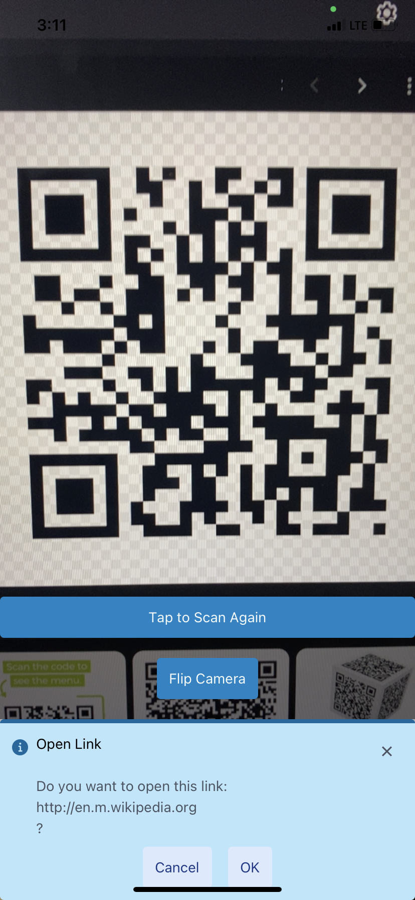

# React Native Camera App

This project is a React Native application that utilizes the device's camera to scan QR codes and provide an option to open URLs contained within them. The app also supports flipping the camera view between the front and back cameras.

## Features

- Camera access to scan QR codes.
- QR code scanning with alert prompts to open URLs.
- Toggle between front and back camera views.
- Permission requests for camera access.

## User Stories

- **As a user, I want to scan QR codes**, so that I can access web content without manually typing URLs.
- **As a user, I want to be prompted before a URL opens**, so that I don't accidentally visit unwanted webpages.
- **As a user, I want to be able to flip the camera**, so that I can switch between front and back views easily.
- **As a user, I want to rescan QR codes**, so that I can quickly scan multiple codes in succession.

## Screenshots

- **Camera Flip** - _Shows the toggle button for flipping the camera._

- **Camera Flip Front**

- **Camera Flip Back**

- **QR Code Scanning** - _Displays the camera detecting a QR code._
  
- **Before**

- **After**

## URLs

- **My app QR Code**

- **UML**

  - [PR 1](https://github.com/KatKho/camera/pull/1)
  - [PR 2](https://github.com/KatKho/camera/pull/2)

## Usage

Upon launching the app, you will be prompted to grant camera permissions. Once granted, the app will display a camera view.

- To scan a QR code, simply point the camera at the code.
- If the QR code contains a URL, an alert will prompt you to open the link.
- Use the "Flip Camera" button to toggle between the front and back cameras.
- If a QR code has been scanned, a button will allow you to reset the scanner for a new scan.

## Contributors

- Ekaterina Khoroshilova
- ChatGPT: Assisted with documentation
